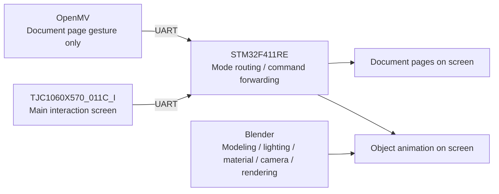

# Red Relic Dual-Mode Display Design

## 1. Project Positioning

This project is now split into two exhibition modes shown on the TJC serial screen:

1. Document relic mode
2. Object relic mode

The screen is the final presentation carrier. Blender is used to build and render the digital content in advance, while STM32 and TJC provide the interactive front end.

## 2. Two Content Modes

### 2.1 Document Relic Mode

This mode is used for scanned or reconstructed historical documents, letters, notices, newspapers, or manuscripts.

Features:

- TJC screen displays document pages or page images
- OpenMV is only used here for page-turn interaction
- Gesture result is translated by STM32 into page up/page down actions
- Screen also provides buttons for:
  - `Intro`
  - `Background`
  - `Year`
  - `Prev`
  - `Next`
  - `Home`

### 2.2 Object Relic Mode

This mode is used for physical relics such as badges, tools, statues, weapons, seals, radios, or other red-culture objects.

Features:

- Blender builds the object model
- Blender sets material, lighting, camera, and renders a 360-degree turntable animation
- TJC screen only plays the exported animation
- No OpenMV visual control is used in this mode
- Screen also provides buttons for:
  - `Intro`
  - `Background`
  - `Year`
  - `Play`
  - `Replay`
  - `Home`

## 3. System Structure

## 4. Main Workflow

### 4.1 Document Relic Workflow

1. Prepare document page images.
2. Import them into the TJC project as page resources.
3. Use TJC pages or image components to display pages.
4. OpenMV recognizes `NEXT_PAGE` and `PREV_PAGE`.
5. STM32 routes the gesture only when current mode is `DOCUMENT`.

### 4.2 Object Relic Workflow

1. Build the red relic model in Blender.
2. Set material and lighting.
3. Place a camera orbit or rotate camera around the relic for 360 degrees.
4. Render the animation to video or image sequence.
5. Import the final animation/video-compatible asset into the TJC presentation flow.
6. Use TJC as the playback and information display terminal.

## 5. TJC Page Planning

Recommended page structure:

| Page | Name | Purpose |
|---|---|---|
| `page0` | Home | Choose `Document` or `Object` mode |
| `page1` | Document Viewer | Show current document page |
| `page2` | Object Viewer | Show object animation playback |
| `page3` | Intro | Show relic introduction |
| `page4` | Background | Show historical background |
| `page5` | Year | Show unearthed year / era / source |

## 6. Information Buttons

Both modes should expose the same information buttons for consistency:

- `Intro`
- `Background`
- `Year`

Suggested content:

- `Intro`: relic name, category, short description
- `Background`: historical significance, event relation, person relation
- `Year`: unearthed year, collection year, or historical era

## 7. OpenMV Usage Boundary

OpenMV is no longer used as a universal 3D object controller.

It is only reserved for document mode page turning:

- left gesture -> previous page
- right gesture -> next page

This reduces system risk and makes the final work easier to stabilize.

## 8. Delivery Goal

The final work should look like a polished digital exhibition terminal:

- one screen
- two relic categories
- one consistent information structure
- document mode with visual page-turning
- object mode with Blender-rendered 360-degree animated showcase
