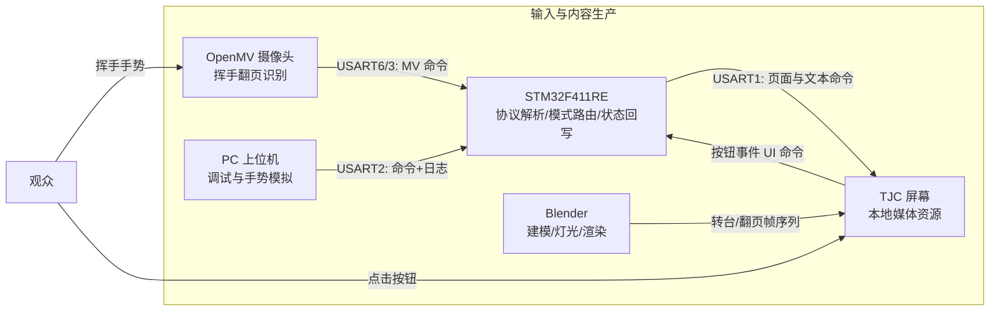
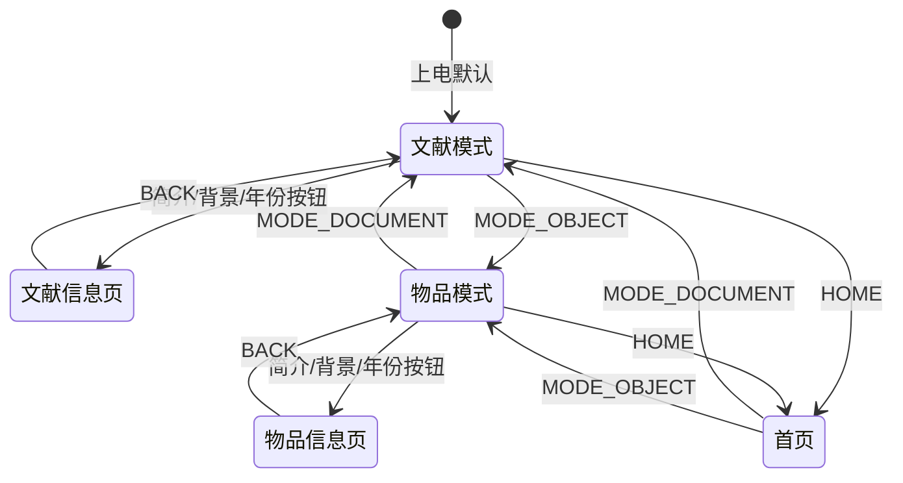
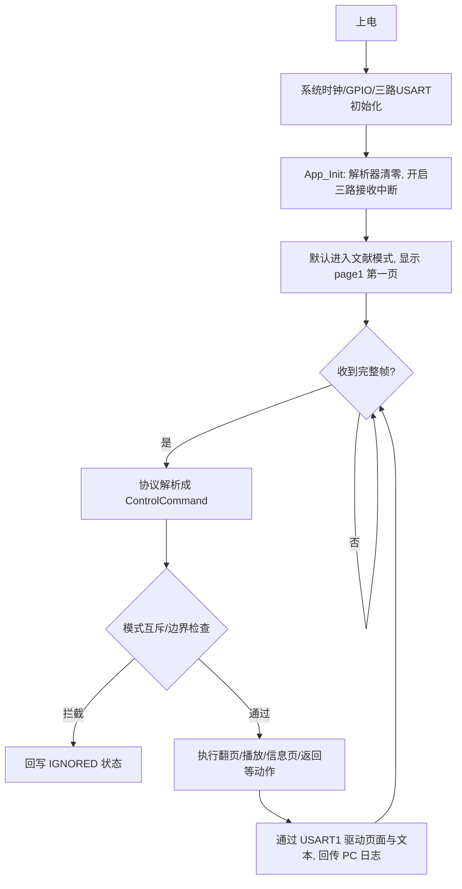
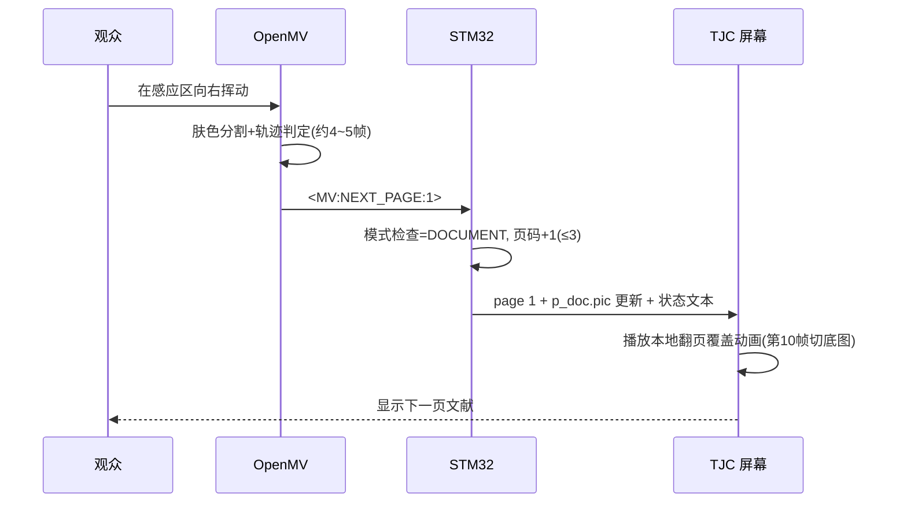
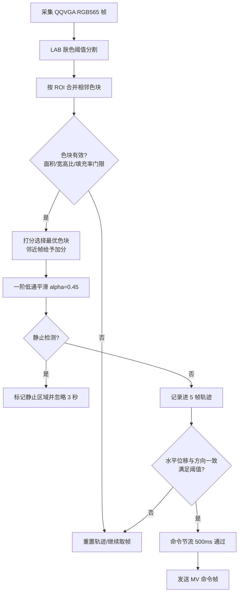

# 26-blender-stm
  # “红色文物·数字交互展示终端”设计报告

> 基于 STM32F411RE + TJC 串口屏 + OpenMV 摄像头 + Blender 数字建模的双模式红色文物智慧展台

| 项目 | 内容 |
|---|---|
| 作品名称 | 红色文物·数字交互展示终端 |
| 作品定位 | 面向博物馆、红色展馆与思政展陈的桌面化数字文物展台 |
| 主控平台 | STM32F411RE（84 MHz / HAL 库） |
| 交互终端 | TJC1060X570 串口屏（文献页 + 物品页 + 信息页共 9 页） |
| 视觉模块 | OpenMV（QQVGA 160×120，肤色轨迹挥手识别） |
| 建模渲染 | Blender（Cycles，物品 360° 转台动画 + 文献翻页动画） |
| 参赛/课题名称 | 红色文物数字建模交互系统 |
| 队伍成员 | 14 |

## 摘要

本作品是一台“一块屏、两类文物、一套统一信息结构”的数字展台。物品类文物由 Blender 完成建模、材质、灯光与 360° 转台动画的离线渲染，再交给 TJC 串口屏本地播放；文献类文物以高清页面图形式展示，并提供由 OpenMV 摄像头实现的“隔空挥手翻页”无接触交互。STM32F411RE 作为主控，完成三路串口的协议解析、模式路由、命令仲裁与屏幕状态回写，并用 PC 上位机辅助联调。整机把“数字建模为文物赋能、嵌入式系统优化游客交互”落实为可稳定演示的完整闭环。

---

## 一、作品功能、核心技术及整体效果

### 1.1 作品功能

| 模式 | 展示对象 | 主要交互 | 屏幕页面 |
|---|---|---|---|
| 文献类 DOCUMENT | 革命文献、书信、报刊等页面 | 屏幕按钮翻页 + OpenMV 挥手翻页 | page1 主页面；page3/4/5 信息页 |
| 物品类 OBJECT | 红色文物三维动画 | 按钮播放 / 重播 360° 转台动画 | page2 主页面；page6/7/8 信息页 |

两模式共用统一信息结构，每件展品都可查看“简介 / 历史背景 / 出土年份”，并支持返回上级、返回首页、模式切换；屏幕状态栏（`t_mode` / `t_cmd` / `t_link`）实时反馈当前模式、动作与链路状态。

功能清单如下：

- 双模式切换与互斥保护：物品模式下忽略翻页命令，文献模式下忽略播放命令，从协议层拦截误操作；
- 文献翻页：屏幕按钮与 OpenMV 手势都能触发上一页/下一页，页码自动钳制在 1~3 页，资源上预留到 8 页的扩展；
- 物品 360° 展示：播放 Blender Cycles 渲染的转台序列（当前资产 72 帧、约 5°/帧，脚本默认可出 180 帧）；
- 信息页导航：每件展品支持简介、背景、年份三类说明页，并可一键返回原展示页；
- PC 上位机联调：`serial_control_panel.py` 可代替屏幕发命令、代替 OpenMV 模拟手势、查看 STM32 回传日志，便于现场排障与演示教学。

### 1.2 核心技术

1. 数字建模与离线渲染（Blender）：多边形建模 → UV 贴图 → Principled 材质 → 三点布光 → 相机环绕轨道 → Cycles 渲染 → 输出 1060×570 帧序列。把真实文物转化为可复播、可放大、无拍摄成本的数字资产。
2. 嵌入式主控与串口协议（STM32F411RE）：三路 USART（TJC / PC / OpenMV）以中断逐字节收帧，ASCII 帧 `<源:命令:值>` 在中断回调内完成解析，状态机统一仲裁后驱动屏幕页面、图片与文本组件。
3. 机器视觉手势识别（OpenMV）：肤色 LAB 阈值分割 → 色块合并与形态学滤波 → 一阶低通平滑 → 多帧方向一致性统计 → 判定后经 UART3 上报 `NEXT_PAGE / PREV_PAGE`。
4. 屏端本地媒体播放（TJC）：转台动画与翻页动画都以本地资源方式播放，STM32 只发“切页/播放/回写状态”的短命令，不依赖实时图像推流，现场稳定性高。
5. 调试支撑（Python + pyserial）：上位机实现命令面板、收发日志与状态猜测显示，缩短联调闭环。

### 1.3 整体效果


展台以桌面机形态呈现：屏幕居中朝向观众，摄像头固定在屏幕一侧的操作区。观众走近后不必触碰屏幕，在感应区挥手即可完成文献翻页，交互新鲜、卫生且低门槛；物品模式下，老物件以三维转台形式连续旋转展示，观众可结合简介页了解其历史背景与年代，获得“看得见、摸不着、玩得动”的数字观展体验。

---

## 二、项目背景与设计意义

### 2.1 数字建模为文物赋能

红色文物具有种类杂、体积小、易损毁、不便巡展等特点，真实文物很难被频繁移动和触摸。数字建模让文物“活起来”：

- 资产化：Blender 建立的可复用三维资产，可随时重新打光、换视角、出图出视频，无需再次接触实物；
- 安全化：用渲染动画替代实物上手，避免展陈过程中的搬运损耗与保管风险；
- 传播化：数字资产可低成本复制到不同终端与线上平台，扩大红色教育的覆盖面；
- 细节化：360° 转台让观众看清文物正面、侧面、顶面等平时不易观察的角度，配合材质光影还原其质感。

### 2.2 嵌入式优化游客交互

传统展柜“只能看、不能碰”，按键一体机又存在排队、接触卫生、操作门槛等问题。本作品用嵌入式系统重构参观动线：

- 无接触手势翻页：OpenMV 识别挥手方向，观众悬空即可翻文献，交互直观且减少交叉接触；
- 双模式一键切换：STM32 集中仲裁，观众在一台终端上即可在不同类型展品之间漫游；
- 稳定低负担：屏幕本地播放媒体、主控只传命令，把实时渲染与推流的不可控因素从现场剔除，适合长时间无人值守运行；
- 低成本高复用：整套硬件（主控 + 串口屏 + 摄像头）成本可控、体积小，可部署在展柜旁、走廊或思政课堂。

### 2.3 意义小结

作品用“嵌入式 + 三维数字内容”的组合，把红色文献与红色老物件从静态展柜搬进可交互的数字空间，降低观展门槛、增强沉浸感，同时锻炼了三维建模、机器视觉、嵌入式协议与系统联调的综合能力，具备校园展陈与科普教育的实际应用价值。
*** End Patch
---

## 三、系统总体设计

### 3.1 系统架构



分工原则：**Blender 负责离线内容、TJC 负责播放与按钮、STM32 负责逻辑与路由、OpenMV 只做文献翻页手势**，任何一路“实时三维控制”都不进入交付链路，从而把整机可靠性放在首位。

### 3.2 硬件组成与串口分配

| 模块 | 型号/说明 | 与主控连接 | 波特率 |
|---|---|---|---|
| 主控 | STM32F411RE（Cortex-M4，SYSCLK 84 MHz） | — | — |
| 串口屏 | TJC1060X570_011C_I | USART1：PA9 TX / PA10 RX | 115200 8N1 |
| 视觉模块 | OpenMV（RGB565，QQVGA） | USART6：PC6 TX / PC7 RX（预留，与 USART3 二选一接线） | 115200 8N1 |
| 调试串口 | USB-TTL | USART2：PA2 TX / PA3 RX | 115200 8N1 |
| 建模渲染 | PC + Blender | 不接入实时链路，仅离线产出素材 | — |

注：TJC 屏多为 5V TTL 电平，接入 3.3V 的 STM32 前需确认电平兼容（必要时加电平转换/分压），这是整机稳定性的一个关键工艺点。

### 3.3 通信协议

统一使用可读 ASCII 帧：

```text
<源:命令:值>
```

典型命令帧（节选）：

```text
<UI:MODE_DOCUMENT:1>    屏幕按钮：进入文献模式
<UI:MODE_OBJECT:1>      屏幕按钮：进入物品模式
<UI:NEXT_PAGE:1>        屏幕按钮：下一页
<UI:SHOW_DOC_INTRO:1>   屏幕按钮：文献简介
<UI:PLAY_OBJECT:1>      屏幕按钮：播放 360° 动画
<MV:NEXT_PAGE:1>        OpenMV 挥手：下一页
<MV:PREV_PAGE:1>        OpenMV 挥手：上一页
```

STM32 对每路输入使用独立 `FrameParser`：以 `<` 开始收帧、`>` 结束成帧，缓冲区 64 字节防溢出，未知/半截帧自动丢弃后重新同步；成帧后按“模式互斥 → 页码边界 → 信息页跳转”的顺序仲裁，并把可读命令回传到 PC 串口供观测。

### 3.4 屏幕页面结构

| 页号 | 页面 | 用途 |
|---|---|---|
| page0 | Home | 模式选择首页 |
| page1 | Document | 文献类主展示页（底图 `p_doc` + 翻页动画层） |
| page2 | Object | 物品类主展示页（360° 动画播放） |
| page3/4/5 | Doc Intro / Background / Year | 文献类三类信息页 |
| page6/7/8 | Obj Intro / Background / Year | 物品类三类信息页 |

页面与组件命名在 `App/app_logic.c` 中固定（`t_mode`、`t_cmd`、`t_link`、`p_doc`），保证“屏幕工程 ↔ 固件”命名强一致，降低联调错位风险。

### 3.5 软件状态机



核心约束：`NEXT/PREV_PAGE` 仅在文献模式生效；`PLAY/REPLAY_OBJECT` 仅在物品模式生效；越界命令一律显示 `IGNORED` 并回写状态栏。

---

## 四、软件系统流程图与摄像头处理算法

### 4.1 系统主流程



### 4.2 文献翻页交互时序



### 4.3 摄像头处理算法

#### 4.3.1 算法演进

- v1（`openmv/main.py`，原型）：整幅 QQVGA 做肤色分割 → 取最大色块 → 相邻帧质心 X 位移超过 28 px 判为左右挥动。实现简单，但易受背景类肤色、静止物体和快速抖动的干扰。
- v2（`openmv/openmv_gesture.py`，当前主版本）：在 v1 之上加入 ROI 限定、形态学门限、轨迹方向一致性、垂直漂移限制、静止物体抑制与命令节流，抗误触能力明显提升。

#### 4.3.2 关键参数

| 参数 | 取值 | 作用 |
|---|---|---|
| 分辨率 / ROI | QQVGA 160×120；ROI=(16,10,128,96) | 提高帧率并聚焦操作区 |
| 肤色阈值（LAB） | L 18~78，A 8~48，B 4~38 | 分割手部肤色候选 |
| 面积门限 | 600~12000 px | 过滤过小噪点与过近占满画面目标 |
| 宽高比 / 填充率 | 0.55~1.95 / 0.16~0.80 | 拒绝条状、过散或近似矩形背景团块 |
| 轨迹历史 | 5 帧 | 统计方向一致性 |
| 判定条件 | 总水平位移≥24 px 且同向步数≥3 步且单步≥3 px 且均值≥4 px/帧 | 保证是连续同向挥动 |
| 垂直漂移上限 | 16 px | 排除斜向/上下抖动 |
| 静止抑制 | 连续 10 帧位移≤2 px → 忽略 3 s | 防静止手掌/背景误触 |
| 命令节流 | 500 ms（v1 为 700 ms） | 防连发与回弹误触发 |

#### 4.3.3 算法流程



#### 4.3.4 判定要点

- 只有“同向且连续”的水平位移才被接受，避免把进入画面、收回手臂等动作误判为翻页；
- 垂直漂移超过 16 px 直接放弃本段轨迹，防止上下扫动触发；
- 挥手结束后手臂停在操作区，静止抑制逻辑会把它“忽略 3 秒”，避免一次挥手连翻两页；
- OpenMV 只在文献模式有意义，其余时刻即使收到该命令，STM32 也会在模式检查处丢弃。
*** End Patch

---

## 五、量化指标

### 5.1 指标总表

> 表中数值由“代码参数推导 + 原型联调”给出，属于设计指标；正式验收前建议按 5.3 的测试方法补录现场实测样本并回填“实测值”。

| 指标 | 设计值/目标 | 实现依据与说明 |
|---|---|---|
| 按键链路响应时间（按钮→页面动作） | ≤ 100 ms（典型几十 ms） | 帧长≤20 B @115200 传输约 1.7 ms，STM32 中断解析微秒级，TJC 页切换/组件刷新为屏端内部操作 |
| 手势端到端响应时间 | 典型 0.3~0.5 s，目标 ≤ 0.6 s | OpenMV 判定需 4~5 帧轨迹（约 0.13~0.2 s @约30 FPS）+ 串口 1.7 ms + MCU 转发 <1 ms + 屏启动动画 |
| 翻页命令最小间隔（节流） | 0.5 s（v1 0.7 s） | 代码 `COMMAND_COOLDOWN_MS`，防止回弹/连发，换算最大约 2 次/秒 |
| 水平位移判定精度 | ≥ 24 px（画幅宽 160 px，约 15%） | v2 `SWIPE_DISTANCE_X`；同向步数 ≥3/5、单步≥3 px、均值≥4 px/帧 |
| 垂直漂移容限 | ≤ 16 px，超过即放弃本段轨迹 | `MAX_VERTICAL_DRIFT`，抑制斜向扫动误判 |
| 有效识别距离范围（工作距离） | 约 0.25~0.9 m（推荐操作区中心≈0.4 m） | 由面积门限 600~12000 px 与手部投影尺寸共同界定：过近色块溢出/超面积被拒，过远像素不足漏检；需按现场镜头高度实测标定 |
| 左右挥动方向识别准确率（目标） | ≥ 90%，主区良好光照下方向正确率目标 ≥ 95% | 方向一致性 + 低通 + 静态抑制组合判定；背景类肤色越多准确率越受挑战 |
| 误触发率（目标） | ≤ 5% | 静止抑制（10 帧→忽略 3 s）、ROI 收窄、模式互斥三道防线 |
| 通信参数 | 115200 baud、8N1、ASCII | 三路 USART 统一配置 |
| 图像分辨率/帧率 | QQVGA 160×120，目标处理帧率 ≥ 25 FPS | 低分辨率换取处理速度，保证挥手轨迹不丢帧 |

### 5.2 四项核心指标的推导说明

1. 响应时间：手势判定需要 5 帧轨迹窗口中至少 3 帧同向位移。按 30 FPS 估算，判定窗口 100~170 ms；命令帧 `<MV:NEXT_PAGE:1>` 共 16 字节，115200 baud 下耗时约 1.4 ms；STM32 在接收中断内完成解析与转发，实际占用在微秒级；TJC 收到 `page 1` 与图片切换命令后启动本地动画。因此把“挥手完成 → 屏幕开始翻页”的典型时延设计在 0.5 s 以内（含防抖余量）。
2. 精度：方向判定不再依赖单帧位移，而是要求“总位移≥24 px、同向步数≥3、单步≥3 px、均值≥4 px/帧”四个条件同时成立，等效于要求一次明确、连续、同向的水平挥动，从算法上压缩随机抖动造成的方向误判。
3. 测距范围：本系统的“距离”体现为摄像头对挥手目标的有效工作距离。近端被 `MAX_AREA=12000 px` 与填充率上限约束（手部过近、色块充满画面会被判无效），远端被 `MIN_PIXELS=600 px` 约束（手部过远、投影像素过少导致漏检）。结合 QQVGA 画幅与常见手部尺寸，设计有效范围约 0.25~0.9 m，适合立在屏幕前 40 cm 左右挥手。
4. 识别准确率：正确识别 = “该翻页时翻且方向正确”。系统通过四层保障逼近目标：形态学门限排除非手目标、方向一致性排除随机抖动、垂直漂移限制排除斜向动作、静止抑制排除遗留手掌与类肤色背景。剩余主要误差来自极端光照与红色/木色等类肤色背景，见 6.3 误差分析。

### 5.3 建议测量方法（现场补录）

- 响应时间：在 OpenMV 串口与屏幕端分别打时间戳（或录 60 FPS 视频逐帧回放），统计从“挥手开始”到“画面开始翻转”的帧数换算时延，样本 n≥50；
- 距离范围：将测距参照物（手掌/色卡）从 0.15 m 以 5 cm 步进移动到 1.2 m，每点做 20 次挥动，统计正检率，得到有效距离上下限；
- 准确率：在 3 种光照（室内常光、强侧光、弱光）下各做 50 次左挥与 50 次右挥，统计方向正确、未响应、误触发三类计数；
- 精度/抖动：用 OpenMV IDE 的帧缓冲导出质心坐标序列，计算相邻帧位移统计量，核对是否落在 3~24 px 判定区间内。

---

## 六、系统测试与结果分析

### 6.1 测试环境

| 项目 | 配置 |
|---|---|
| 主控 | STM32F411RE 核心板/开发板，HSI-PLL 84 MHz |
| 屏幕 | TJC1060X570_011C_I 串口屏（115200 8N1） |
| 视觉 | OpenMV 模块 + 标准 USB 供电 |
| 调试链路 | USB-TTL（USART2 PA2/PA3）→ PC 串口助手 / 上位机 |
| 软件工具 | STM32CubeMX+HAL 工程、Keil 移植副本（stm32_keil）、OpenMV IDE、Blender、Python3+pyserial |
| 测试环境 | 室内桌面展台环境，普通荧光灯/日光混合照明，摄像头距离屏幕约 0.4 m |

### 6.2 主要测试项与结果

| 编号 | 测试项 | 方法与工具 | 通过标准 | 结果 |
|---|---|---|---|---|
| T01 | STM32 最小转发链路 | TJC/USB-TTL → USART1 → 串口助手核对 | 每个按钮输出唯一对应命令帧，无旧版残留命令 | 通过（命令回显与预期一致） |
| T02 | 协议解析健壮性 | 用 `send_ui_commands.py` 逐条发送 UI 帧并混入噪声/半截帧 | 正常帧全部解析，坏帧被丢弃且不崩溃 | 通过（按 64B 缓冲与同步设计） |
| T03 | 双模式互斥 | 物品模式下发送 `MV:NEXT_PAGE` 等 | 屏幕回写 IGNORED 且不切页 | 通过（逻辑与上位机模拟均符合） |
| T04 | 页面跳转与边界 | 逐页点按 NEXT/PREV 至越界 | 页码钳制 1~3；HOME/BACK 路由正确 | 通过 |
| T05 | OpenMV 挥手翻页 | 在感应区左右挥动，观察屏幕与串口日志 | 左挥上一页、右挥下一页；静止不误触 | 桌面联调通过；现场样本按 5.3 补录 |
| T06 | 双模式按键信息页 | 点按简介/背景/年份与 BACK | 跳到 page3~8 对应页并可返回原模式页 | 通过 |
| T07 | 渲染资源 | Blender 输出转台 72 帧与翻页 40 帧 | 序列完整、命名连续、1060×570/900×500 | 通过（当前资产目录已就绪） |
| T08 | 整机长时间演示 | 连续演示 + 反复模式切换 30 min | 无死机、无串口堆积、状态栏自恢复 | 基本通过，建议正式验收复测 |

### 6.3 误差分析

1. 视觉识别误差（主要误差源）：
   - 光照与色温变化会使肤色像素偏离固定的 LAB 阈值区间，处于门限边缘时色块面积抖动，可能造成单帧漏检并重置轨迹；
   - 距离误差：手部过近时色块面积接近/超过 12000 px 上限被判无效，过远时不足 600 px 被当作噪声，表现为“太近不响应、太远也丢”；这正是 5.2 中工作距离范围需要现场标定的原因；
   - 背景类肤色与“红色文物”本身是红色，若背景红色块进入 ROI，可能与手部色块合并形成伪轨迹；当前依靠 ROI 收窄、形态学门限与静止抑制缓解，仍建议布展时把红色展板移出操作区或使用腕部遮挡；
   - 手势路径误差：斜向、弧线、过快/过慢的挥动会导致垂直漂移超限或同向步数不足而被拒识，这是算法“宁可不翻、不可错翻”策略下的正常权衡。
2. 串口与时序误差：
   - 协议以 `<`、`>` 定界，若总线噪声在帧中出现 `>`，会提前成帧导致该命令被忽略，需重新发送；不产生误命令，只可能“丢一次”；
   - 三路 UART 中断同为最高优先级，理论上有轻微嵌套时延，但每帧解析仅为若干次字符串匹配，实测影响可忽略；
   - 当前固件在接收中断回调内使用阻塞式 `HAL_UART_Transmit` 向屏幕发命令（超时 100 ms），若屏幕掉线或长时间不回读，最坏可能阻塞中断上下文；正常链路下远低于阈值，已列入优化项。
3. 渲染与播放误差：
   - 翻页动画在屏端“第 10 帧附近切底图”，依赖屏端定时器精度，若与渲染帧节奏不同步会出现边缘闪动，建议把 9~11 帧做成接近全覆盖的“安全窗口”；
   - 转台资产按 5°/帧连续旋转，若屏端播放帧率低于素材节奏，会表现为轻微顿挫，建议输出前确认屏端支持的图片切换速率。
4. 测试自身误差：人工计时、人工挥手的起始位置与速度不一致、光照随时间漂移都会引入随机误差，因此 5.3 的样本统计（每项 n≥50）是评估真实准确率的必要条件。
*** End Patch

---

## 七、现有不足与优化方向

### 7.1 集成度不高（不足）与改进方向

现有不足：整机由“STM32 主控板 + TJC 串口屏 + OpenMV 摄像头 + USB-TTL 调试器 + 外置电平转换”等多块板卡拼装而成，存在三类问题：

- 走线多、接插件多：每路 USART 都要独立排线，现场振动或反复搬运容易松动，出现“看似连接、实则悬空”的隐性故障；
- 供电分散、电平混杂：屏幕 5V TTL 与主控 3.3V 需额外做电平兼容，电源分散在各模块，故障排查点多；
- 维护与升级成本高：换一个模块就要重新对线，摄像头安装角度漂移后需要重新标定工作距离。

改进方向：

- 方案 A（板级集成）：把 STM32 与 OpenMV 的视觉处理合并到一颗带摄像头接口的高性能主控（如 ESP32-S3 / 树莓派 / 全志 V3s 等），直接驱动或经单线串口控制屏幕，用一块 PCB + 一个摄像头模组取代多板拼装；
- 方案 B（保留串口屏，优化接插）：把摄像头与主控封装进屏幕背壳的一体化支架内，所有信号走 FPC 排线/板对板连接器，供电统一为 5V 输入 + 板载 LDO 转 3.3V，并内置电平兼容电路；
- 结构层面：用 3D 打印一体展台外壳固定“屏幕 + 摄像头”相对位姿，把工作距离标定一次后长期锁定；
- 软件层面：把三路阻塞式 `HAL_UART_Transmit` 改为 DMA/中断发送，消除最坏情况下中断阻塞隐患；增加心跳与链路自检，掉线自动复位重连。

### 7.2 后续可加入：摄像头拍照打卡功能

作品下一步最有价值的扩展是“参观打卡”，把单向观看变成可带走的记忆：

- 功能设想：观众在展台前摆出指定手势（如五指张开或比“OK”），摄像头抓拍“观众 + 屏幕文物画面”的同框照片，屏幕显示打卡成功并生成打卡编号；
- 实现方式：复用现有 OpenMV 摄像头与肤色检测框架，将挥手识别扩展为“打卡手势识别”；拍照后由 OpenMV 将 JPEG 写入自带 SD 卡，同时通过串口通知 STM32 在屏幕上回显“打卡成功 + 编号”；可外接小型热敏打印机打印带二维码的打卡凭证，扫码即可在手机查看数字文物介绍；
- 需要注意：涉及人像拍摄要增加“已征得同意”提示与隐私说明；打卡照片建议脱敏存储或设置保留期限。

### 7.3 其他优化方向

- 语音讲解：外接语音合成/播报模块，观众点按“简介”时同步播放讲解词，降低阅读门槛；
- 低功耗与自动唤醒：增加红外/接近感应，无人时屏幕休眠、有人靠近自动唤醒并进入导览状态，节能且提升“被关注感”；
- 内容热更新：文献页与转台素材改为 SD 卡/U 盘目录化加载，工作人员可随时更换展品而不改固件；
- 多文物资产库：把“一机一物”扩展为“一机多库”，通过页面目录选择不同红色文物与对应文献；
- 参观数据统计：主控累计模式切换、翻页、播放次数并回传 PC 上位机，供策展方评估观众兴趣；
- 无障碍设计：为按钮增加更大热区与高对比配色，翻页成功时给出震动或音效反馈。

---

## 八、总结

本作品完成了“红色文物数字展台”从三维内容生产到嵌入式人机交互的完整闭环：Blender 把实体文物转化为可复播的 360° 数字资产，STM32 以轻量 ASCII 协议完成多设备路由与模式仲裁，TJC 串口屏承载本地动画与信息页，OpenMV 以肤色轨迹识别提供无接触挥手翻页，PC 上位机则保障了联调与排障效率。系统结构清晰、链路短、可靠性优先，适合博物馆与思政课堂场景。后续将沿着“一体化集成、拍照打卡、语音导览、内容热更新”等方向继续迭代，让红色文物展示更智能、更亲切、更易传播。

---

## 附录：工程文件索引

| 内容 | 位置 |
|---|---|
| 总体设计说明 | docs/01_overall_design.md |
| 串口协议定义 | docs/03_serial_protocol.md |
| Blender 建模与转台指南 | docs/04_blender_scene_build.md |
| 硬件联调清单 | docs/07_hardware_debug_checklist.md |
| 文献翻页屏端逻辑 | docs/10_document_flip_screen_logic.md |
| 文献图片资源规范 | docs/12_document_asset_import.md |
| PC 上位机说明 | docs/15_pc_control_panel.md |
| STM32 固件（HAL 工程） | stm32_f411re_tjc_pc/（App/app_logic.c、App/protocol.c） |
| Keil 移植副本 | stm32_keil/ |
| OpenMV 手势识别 | openmv/main.py（v1）、openmv/openmv_gesture.py（v2） |
| PC 调试工具 | pc/serial_control_panel.py、pc/send_ui_commands.py |
| Blender 建模脚本 | blender/build_grape_radio.py |
| 转台动画渲染脚本 | blender/render_turntable_animation.py |
| 翻页动画渲染脚本 | blender/render_document_flip_overlay.py |
| 渲染产出 | blender/turntable_frames/（72 帧）、blender/document_flip_frames/（40 帧） |
| TJC 页面规范 | tjc/tjc_screen_guide.md |
